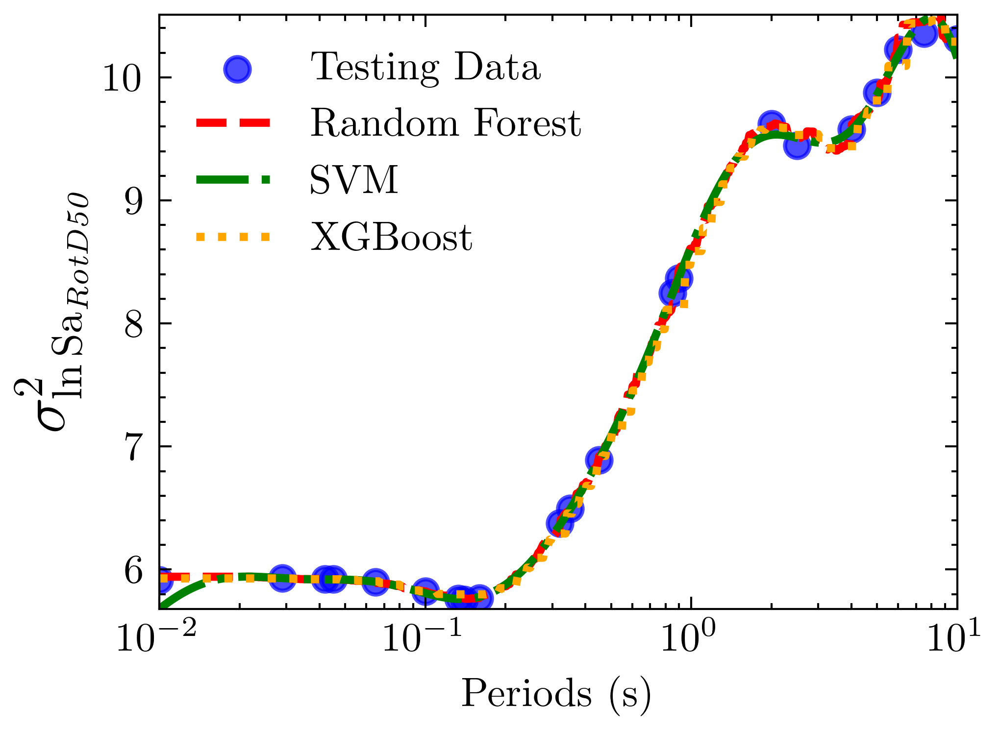
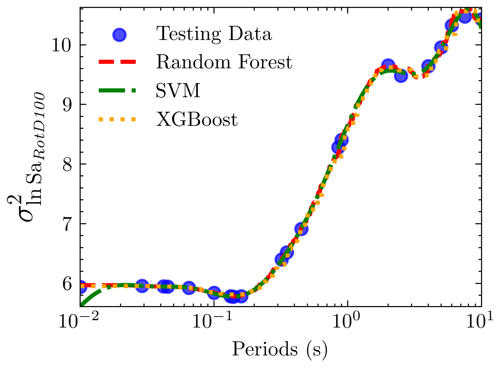
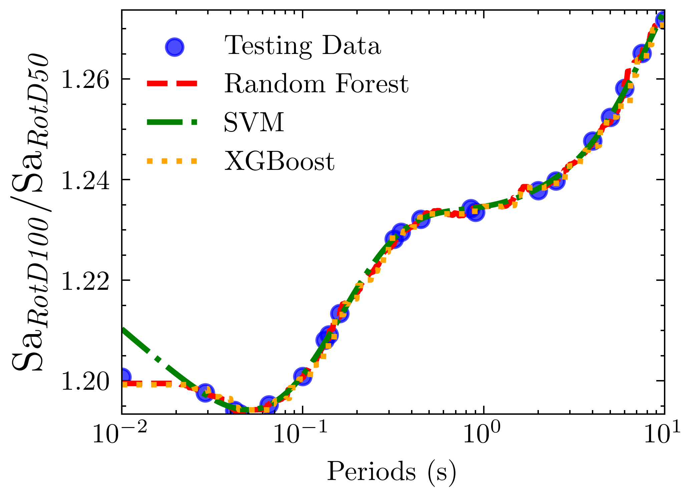
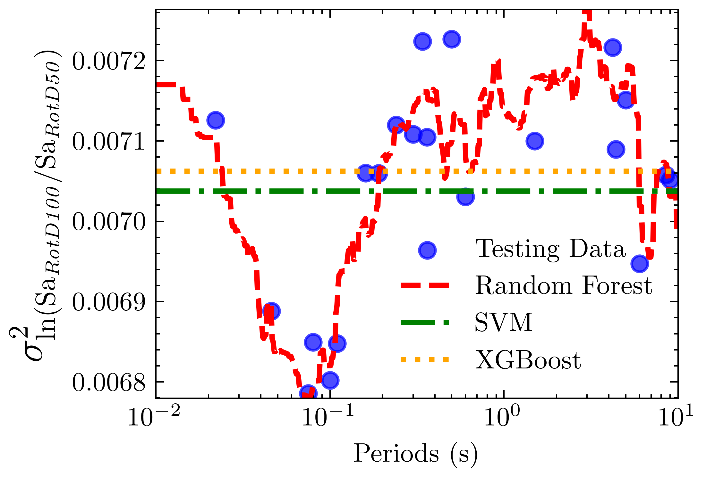

# Machine Learning Approaches for Predicting Ground Motion Directionality Parameters

## Introduction
The Pacific Earthquake Engineering Research Center (PEER) has promoted the development of models to predict ground motion parameters for seismic design. One of these parameters is the maximum spectral response acceleration in all horizontal orientations (SaRotD100), which represents the observed maximum value of spectral acceleration in any direction at each period. Being the main intensity measure used in conventional structural design to compute design forces, accelerations, and displacements in structural and non-structural elements, according to Stewart et al., by definition, SaRotD100 leads to conservative estimates of demands.

In the last two decades, the Probabilistic Seismic Hazard Assessment (PSHA) methodology has been implemented to characterize site-specific seismic hazards using ground motion models (GMMs). These GMMs predict the mean spectral acceleration spectral response acceleration overall horizontal orientations, denoted as SaRotD50. Thus, SaRotD100 being a more meaningful parameter for structural design, there have been many efforts to predict its median value that, for a specific period of vibration, is expressed as:

$$ \mu_{\ln SaRotD100} = \mu_{\ln(SaRotD100 / SaRotD50)} + \mu_{\ln SaGM} $$

and its total variance can be written as:

$$ \sigma^2_{tot, \ln SaRotD100} = \sigma^2_{\ln SaGM} \left( \frac{\sigma_{\ln SaRotD100}}{\sigma_{\ln SaRotD50}} \right)^2 + \sigma^2_{\ln(SaRotD100 / SaRotD50)} $$

where the median of ratio $` \mu_{\ln(SaRotD100 / SaRotD50)} `$, the multiplier $` \sigma_{\ln SaRotD100} / \sigma_{\ln SaRotD50} `$, and the standard deviation of $` \ln(SaRotD100 / SaRotD50) `$ were previously estimated using regression methods; and $` \mu_{\ln SaGM} `$ and $` \sigma_{\ln SaGM} `$ were terms that can be estimated using GMMs, related to the RotD50 orientation.

## Overview
This repository contains the implementation of machine learning models to predict ground motion directionality parameters. The project explores different regression techniques to estimate:
- **$` \ln(SaRotD50) `$** (Sa_RotD50_var)
- **$` \ln(SaRotD100) `$** (Sa_RotD100_var)
- **$`SaRotD100/SaRotD50 ratio`$** (Ratio_median)
- **$`SaRotD100/SaRotD50 variance`$** (Ratio_var)

Three models were tested: Support Vector Machine (SVM), XGBoost, and Random Forest, with **Random Forest consistently achieving the best performance**.

## Repository Structure

```
.
├── Data_Original/        # Raw data in .mat format
│   ├── NGA_W2_corr_meta_data.mat
├── datasets/             # Processed data stored as .pkl files after ETL
│   ├── working_df.pkl
├── models/               # Trained models in .pkl format
│   ├── [model]_[target].pkl           # models
│   ├── [model]_[target]_results.xlsx  # Grid search tuning results
├── figures_report/       # Plots used in the final report
├── deliverables/         # Final outputs
│   ├── Paper_Machine_Learning_Approaches_for_Predicting_Ground_Motion_Directionality_Parameters.pdf
│   ├── Poster_Machine_Learning_Approaches_for_Predicting_Ground_Motion_Directionality_Parameters.pdf
│   ├── Calculator_Ground_Motion_Directionality_Parameters.ipynb  # Use to calculate the ground motion directionality parameter for each target variable
├── 00_ETL.ipynb          # Jupyter notebook for pre-processing the original data
├── 01_Sa_RotD50_var.ipynb   # Jupyter notebooks for training each target variable
├── 02_Sa_RotD100_var.ipynb
├── 03_Ratio_median.ipynb
├── 04_Ratio_var.ipynb
└── README.md
```

## Data
These models will be trained and tested using observed SaRotD50 and SaRotD100 spectra contained in the PEER’s NGA-West 2 database:

- **Original Data**: The `Data_Original` directory contains raw ground motion data in `.mat` format.
- **Processed Data**: The `datasets` directory contains data cleaned and transformed into `.pkl` files.

## Models
- **Training Approaches**: The implemented models SVM, XGBoost, and Random Forest were built using the **scikit-learn** library, with trained models stored as `[model]_[target].pkl`.
- **Hyperparameter Tuning**: Grid search was used for tuning, with results stored in `[model]_[target]_results.xlsx`.

## Results
- **Best Model**: **Random Forest** consistently achieved the highest performance across all target variables.
- The **deliverables/** directory contains the final report and poster in PDF format, along with a notebook for calculating ground motion directionality parameters.

### Model Performance per Target Variable

#### A. Variance of ln 𝑺𝒂RotD50
- **Best Model**: Random Forest
- **Performance Metrics**:
  | Model         | MSE      | R2 Score  |
  |--------------|----------|----------|
  | Random Forest | 0.002244 | 0.999328 |
  | SVM          | 0.004926 | 0.998524 |
  | XGBoost      | 0.007361 | 0.997794 |
- **Prediction Curve**:
  

#### B. Variance of ln 𝑺𝒂RotD100
- **Best Model**: Random Forest
- **Performance Metrics**:
  | Model         | MSE      | R2 Score  |
  |--------------|----------|----------|
  | Random Forest | 0.002317 | 0.999325 |
  | SVM          | 0.007526 | 0.997808 |
  | XGBoost      | 0.008461 | 0.997536 |
- **Prediction Curve**:
  

#### C. Median 𝑺𝒂RotD100/𝑺𝒂RotD50
- **Best Model**: Random Forest
- **Performance Metrics**:
  | Model         | MSE      | R2 Score  |
  |--------------|----------|----------|
  | Random Forest | 4.38e-07 | 0.999244 |
  | XGBoost      | 1.42e-06 | 0.997545 |
  | SVM          | 4.78e-06 | 0.991759 |
- **Prediction Curve**:
  

#### D. Variance of ln (𝑺𝒂RotD100/𝑺𝒂RotD50)
- **Best Model**: Random Forest
- **Performance Metrics**:
  | Model         | MSE      | R2 Score  |
  |--------------|----------|----------|
  | Random Forest | 2.73e-09 | 0.844236 |
  | SVM          | 1.76e-08 | -0.000388 |
  | XGBoost      | 1.80e-08 | -0.027814 |
- **Prediction Curve**:
  

## Getting Started
If you want to use the results of this project, refer to the Jupyter notebook `Calculator_Ground_Motion_Directionality_Parameters.ipynb` in the deliverables/ directory. This notebook computes all four ground motion directionality parameters, requiring only the log period as input, allowing you to directly utilize the parameters in your projects.

## Citation
If you use this work in your research, please cite it as follows:
```
@misc{burgosandcalderon2024groundmotion,
  author = {Marcos Burgos and Victor H. Calderon},
  title = {Machine Learning Approaches for Predicting Ground Motion Directionality Parameters},
  year = {2024},
  howpublished = {GitHub},
  note = {Unpublished work},
  url = {https://github.com/your-repository}
}
```

## License
This project is licensed under the MIT License.